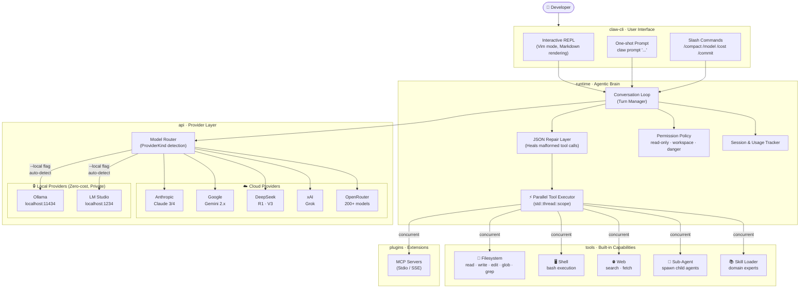

# Claw Code

Claw Code is a high-performance, local-first coding agent. While it was originally built upon the core Rust implementation from [ultraworkers/claw-code](https://github.com/ultraworkers/claw-code), it has since been extensively evolved with an focus on parallel execution, privacy, and multi-model support.

The code and primary implementation live in the **[`rust/`](rust/)** directory.

## Origins & Philosophy

Born from a trace, refined for sovereignty. 

This project began when an accidental source map leak on npm provided a rare glimpse into the mechanics of high-tier agentic interfaces. While the community scrambled to reconstruct the logic, I saw a bigger opportunity: to take those foundations and evolve them into something **faster**, **private**, and **model-agnostic**.

My core philosophy for Claw Code is built on two pillars:

1.  **Privacy First**: No developer should be forced to send their proprietary code to the cloud for intelligence. By integrating native support for **Ollama** and **LM Studio**, Claw Code empowers you to run world-class agents entirely on your local silicon.
2.  **Uncompromising Speed**: Agentic loops are traditionally slow. I implemented a **Parallel Tool Execution** engine in Rust that handles complex multi-file tasks concurrently, slashing latency and making the agent feel like a real-time extension of your own thought process.

Whether you are using **Gemini**, **DeepSeek**, **OpenRouter**, or a **Local Llama**, Claw Code provides the same high-performance, secure, and extensible experience.

## Current status

- **Version:** `0.1.0`
- **Release stage:** Initial public release, source-build distribution
- **Platform focus:** macOS and Linux developer workstations

## Authentication & Providers

Claw Code supports multiple backend providers through a unified interface.

### Hosted Providers
Set the relevant environment variables for your chosen provider:
- **Anthropic**: `ANTHROPIC_API_KEY`
- **Gemini**: `GEMINI_API_KEY`
- **Grok**: `XAI_API_KEY`
- **DeepSeek**: `DEEPSEEK_API_KEY`
- **OpenRouter**: `OPENROUTER_API_KEY`

### Local LLMs (Ollama / LM Studio)
Claw Code features a **zero-cost, privacy-first local inference layer**. It can auto-detect locally running model servers on standard ports (11434 for Ollama, 1234 for LM Studio).

### OAuth Verification
For supported platforms, you can use the built-in OAuth flow:
```bash
cargo run --bin claw -- login
```

## Install and Run

### One-liner Install (Easiest)
Run the automated installer to download and install the pre-built binary for your system:
```bash
curl -sSL https://raw.githubusercontent.com/varshith-Git/nexus-code/main/install.sh | sh
```

### Manual Installation (From Source)
If you prefer to build from source:
```bash
cd rust/
cargo install --path crates/claw-cli --locked
```

## Quick Start (Run)
Once installed, you can start using Claw Code immediately:
```bash
# Start interactive REPL
claw

# Start REPL with local model auto-detection
claw --local

# One-shot prompt
claw prompt "summarize this workspace"
```

## Supported capabilities

- **Local LLM Intelligence**: Connect to Ollama or LM Studio for 100% private, offline coding.
- **Multi-threaded Parallel Tool Execution**: Concurrent processing of complex agent workflows for ultra-low latency.
- **Robust Tool Calling**: Built-in JSON recovery layers ensure stability even with smaller local models.
- **Model Context Protocol (MCP)**: Extend functionality with external tool servers (Stdio/SSE).
- **Interactive REPL**: Rich terminal experience with markdown rendering and Vim-mode support.
- **Granular Permissions**: Fine-grained security modes (`read-only`, `workspace-write`, `danger-full-access`).
- **Slash Commands**: High-level controls for history compaction, cost tracking, git workflows, and more.

## Architecture

The diagram below shows the full system design, highlighting the three core innovations: **parallel tool execution**, **multi-provider routing**, and **local LLM detection**.



### Crate Breakdown

| Crate | Responsibility |
| :--- | :--- |
| **[`claw-cli`](rust/crates/claw-cli/README.md)** | User-facing binary, REPL engine, local model autodetect |
| **[`api`](rust/crates/api/README.md)** | Unified provider router, SSE streaming, local LLM detection |
| **[`runtime`](rust/crates/runtime/README.md)** | Agentic loop, parallel execution, JSON repair, permissions |
| **[`tools`](rust/crates/tools/README.md)** | Built-in toolset (Filesystem, Shell, Web, Sub-agents) |
| **[`commands`](rust/crates/commands/README.md)** | REPL slash-command registry and handlers |
| **[`plugins`](rust/crates/plugins/README.md)** | MCP server lifecycle and tool aggregation |
| **[`lsp`](rust/crates/lsp/README.md)** | Workspace context extraction via Language Server Protocol |


## Roadmap

- [ ] **TUI Elements**: Rich progress visualization and interactive dashboard.
- [ ] **Advanced Memory**: Long-term memory management and RAG-based context injection.
- [ ] **Public Artifacts**: Automated release packaging for macOS/Linux/Windows.

## Acknowledgements

Special thanks to the team at **[ultraworkers](https://github.com/ultraworkers)** for providing the initial foundation of the Claw Code Rust workspace. This project serves as an evolution of that work, optimized for extreme speed and local-first sovereignty.

## License

See the **[LICENSE](LICENSE)** file for details.
